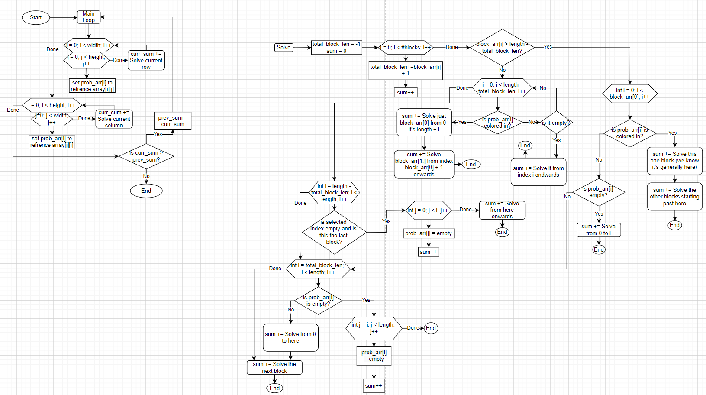

# NonogramSolver
A package built to solve nonograms

## What is a nonogram?
A nonogram is a japenese puzzle, where you are given the rough layout of how many squares are filled linearly in each column and row. Your job is to figure out based on the orginization of these "blocks" the exact pattern of the puzzle.

## How do I store data (implimentation in progress)

This program stores data in a 2d array of structures.

These structures each contain 2 booleans, the first is if the structure is known to be occupied, and the second is if the structure is known to be empty. In absence of both, the structure is undecided. (It is not possible for a structure to be both occupied and empty).

## How do I input data?
Later I plan to make an actual interface for the project, but for the intrest of time, the project will be run using the terminal and will accept data from a file. The format will be the width then height for the first line, then for every line after, the number of blocks in that row/column, and then the blocks in that row.
For example:   
`3 3    
1 3   
2 1 1   
1 3   
   
1 3   
1 3   
2 1 1   
1 3`   
(this makes a block with a hole in the middle)

## General words I use that I should explain:
- Block: the number written to the left of the row / above the column
- space / index: the box coresponding to wherever on the array / prob array I'm refrencing
- Block array: Pretty much a section of the row / column array passed into thesolve function
- Probability array: a copy of the main array that contains pointers to the indexes.
- blocks: the number of blocks in the array
- length: the length of the probability array
- total block length: Because having one block touch another block would mean we just have 1 block, this is just the sum of all blocks + the number of blocks - 1 This gives the actual length of the blocks for that row / column. If this is longer than half the length, there has to be a full space somewhere.

## How do I solve this puzzle?
To solve this puzzle, I start at the main function which first calls the solve function on all the rows, and then all the columns. After that is complete, it counts all of the spaces solved, and compares that to the sum of the previous itteration. If it hasn't solved more spaces since then, we confidently know that there isn't any more progress to be made, and can confidently say that the puzzle is solved to the best of the algorithm's ability.

### How does the solving function work
The sovling function is a recursive function that tries to constrict the possible number of spaces within the current row/column, and based off of that it then marks spaces either occupied or empty. Here is a short bit of psudocode to show how the function works:

`
function solver (probability_array, length, block_array, num_blocks) {

if (blocks == 0)
  mark rest empty and return the number answered.
if (length == 0)
  no more stuff to change: return 0;

if (block_arr[0] > length - total_block_len)
  check for empty / full spaces that would constrian the length.
  fill in the center blocks up to the end of block_arr[i].
endif
else
  check for empty/full spaces that would constrain the length.
endelse
  check the end for empty/ occupied spaces that would constrain the lenght.
recurse to the next block in the array, and reduce the length to reflect that.
return the number of spaces we have calculated.
`

Currently, I think this is about the most effecient I can get this program,
algorithm wise, now I'm just working on optimizing storage requirements.

In terms of a sense of how long this takes in total, here's a full flowchart of the program: (note, this is mainly for time calculation purposes)

